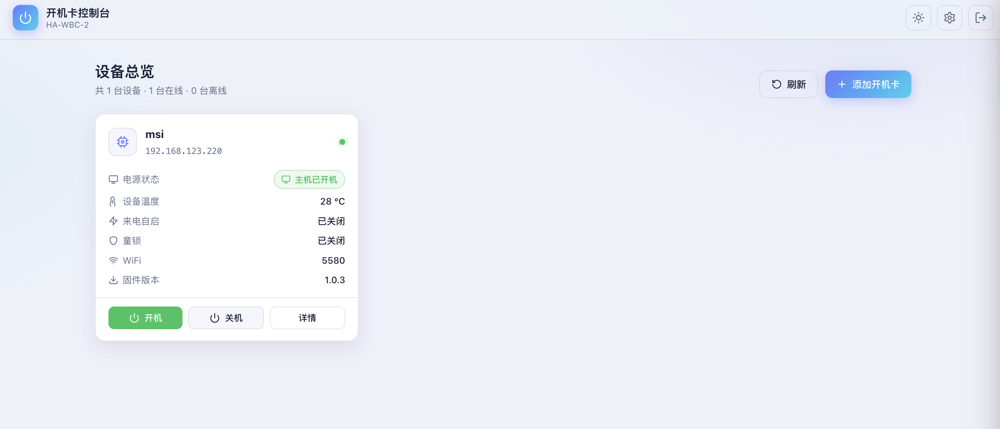
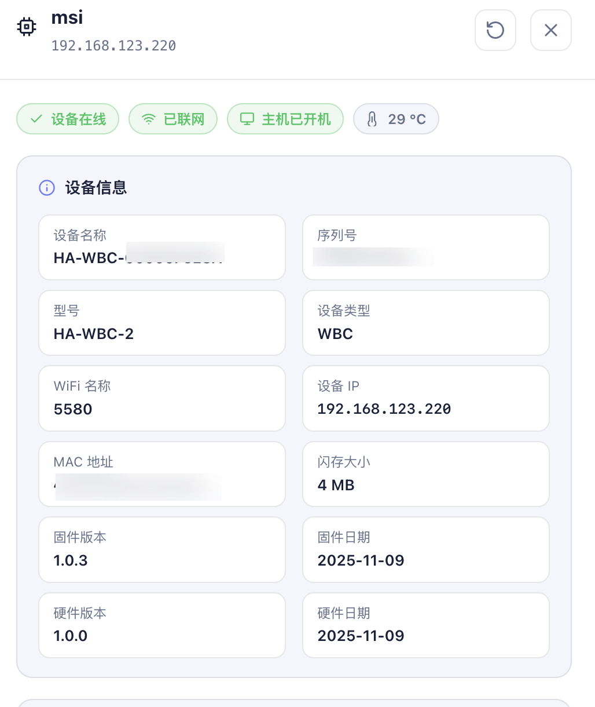
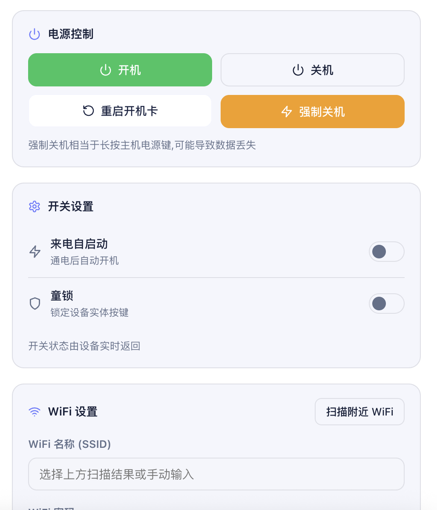
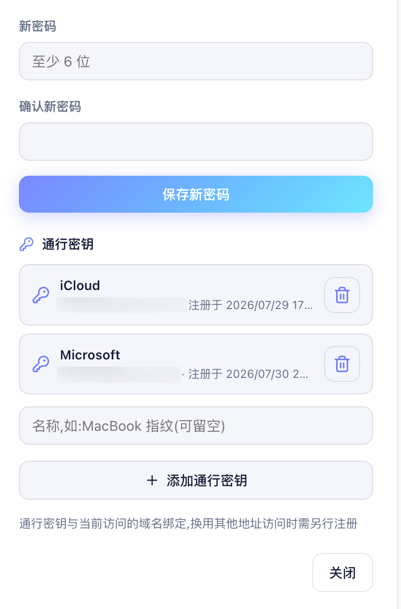

# HA-WBC-2 Control Panel

一个使用 Go 编写的 HA-WBC-2 局域网开机卡集中控制面板。程序以单个二进制运行，内嵌响应式中文 Web 页面，无数据库和前端构建依赖，适合部署在电脑、NAS、软路由或家庭服务器上。

> 当前构建版本：`1.3.2`
>
> 原作者/项目维护者：**WuBarlynn**。复制、修改、分发或二次开发时，必须保留原作者版权声明和 MIT 许可证，并注明本项目来源。

## 截图










## 功能

- 多设备添加、编辑、删除和连通性测试
- 每 5 秒并发刷新设备总览
- 实时读取设备状态：
  - 温度 `tP`
  - 主机开机状态 `pW`
  - 来电自启 `aS`
  - 童锁 `cL`
- 主机开机、关机及强制关机
- 重启 HA-WBC-2 开机卡
- 设置来电自启与童锁
- 扫描附近 WiFi、显示信号强度并修改配网
- 查看序列号、MAC、IP、型号、闪存和固件/硬件版本
- 检查固件更新、执行更新并显示升级进度
- 恢复设备出厂设置
- 深色/浅色主题及移动端响应式布局
- 管理员密码与 WebAuthn Passkey 登录：通过 HTTPS 域名访问时自动启用 Passkey 能力，无需额外配置即可注册并使用指纹、面容或安全密钥登录
- 内置模拟设备，方便在没有硬件时体验和测试

## 工作方式

浏览器只与控制面板通信，不直接接触开机卡密码或设备令牌。后端根据已保存的 WiFi 密码登录设备并取得 `tK`，随后使用 `Authorization: Bearer <tK>` 调用设备 API。令牌失效时，后端会重新登录并重试一次。

```text
浏览器
   │  控制台 Bearer 会话
   ▼
Go HTTP Server
   ├── 管理员认证 / Passkey
   ├── JSON 文件存储
   └── HA-WBC-2 API Client
          │  设备 Bearer tK
          ▼
      HA-WBC-2 设备
```

## 快速开始

### 使用预编译程序

从项目 Release 或本地 `dist/` 目录下载对应平台的 `1.3.2` 二进制：

| 平台 | 文件名 |
| --- | --- |
| Linux x86-64 | `ha-wbc-console_1.3.2_linux_amd64` |
| Linux ARM64 | `ha-wbc-console_1.3.2_linux_arm64` |
| macOS Intel | `ha-wbc-console_1.3.2_darwin_amd64` |
| macOS Apple Silicon | `ha-wbc-console_1.3.2_darwin_arm64` |
| Windows x86-64 | `ha-wbc-console_1.3.2_windows_amd64.exe` |
| Windows ARM64 | `ha-wbc-console_1.3.2_windows_arm64.exe` |
| Windows 32 位 | `ha-wbc-console_1.3.2_windows_386.exe` |

Linux/macOS：

```bash
chmod +x ha-wbc-console_1.3.2_linux_amd64
./ha-wbc-console_1.3.2_linux_amd64
```

Windows：

```powershell
.\ha-wbc-console_1.3.2_windows_amd64.exe
```

打开 `http://127.0.0.1:8088`。首次运行时设置管理员密码，然后添加开机卡的名称、局域网地址和设备所连 WiFi 的密码。

### 命令行参数

```text
-addr string    监听地址，默认 :8088
-data string    数据文件路径，默认 ha-wbc-data.json
-log string     日志文件路径，默认输出到终端
-tls            启用 HTTPS；未指定证书时自动生成自签名证书
-cert string    TLS 证书文件，需与 -key 同时提供
-key string     TLS 私钥文件
-mock int       启动指定数量的模拟设备，默认关闭
-version        显示程序版本
```

示例：

```bash
./ha-wbc-console -addr 0.0.0.0:8088 -data /opt/ha-wbc/data.json -log /opt/ha-wbc/wbc.log
```

日志文件超过约 1 MB 后会轮转为 `.old`，仅保留一份旧日志，总占用约 2 MB。

## 无硬件演示

```bash
./ha-wbc-console -mock 2
```

程序会启动两台模拟开机卡：

- 地址：`127.0.0.1:18080`、`127.0.0.1:18081`
- WiFi 密码：`12345678`

在页面中按上述信息添加设备即可测试控制、状态查询和固件更新流程。

## HTTPS 与 Passkey

### HTTPS 域名自动启用 Passkey

这是本项目的核心亮点之一：当使用 **HTTPS 域名**访问控制面板时，程序会自动从请求的 `Host` 识别 WebAuthn rpID，并在浏览器满足安全上下文要求时自动启用 Passkey 功能，**无需手动填写域名、rpID 或额外修改配置文件**。

首次仍需使用管理员密码登录，然后进入「系统设置 → 通行密钥」注册指纹、面容或硬件安全密钥。注册完成后，登录页会自动显示「使用通行密钥登录」，后续即可免输密码登录。

管理员密码登录可通过 HTTP 使用，但 WebAuthn Passkey 受浏览器安全策略限制：

| 访问方式 | Passkey |
| --- | --- |
| `http://localhost:8088` | 可用 |
| 局域网 IP 地址 | 不可用，WebAuthn 的 rpID 不能是 IP |
| 域名 + HTTPS | 可用，推荐 |

推荐由 Nginx、Caddy、frp 或其他反向代理终结 TLS，控制面板监听本地 HTTP。只要代理正确保留原始 `Host`，控制面板就会自动推导 WebAuthn rpID 并启用 Passkey，无需为反向代理场景单独配置本项目。

若直接启用 HTTPS：

```bash
./ha-wbc-console -tls
```

未提供 `-cert` 和 `-key` 时，程序会在数据文件所在目录生成有效期十年的 ECDSA P-256 自签名证书。公网部署应使用可信 CA 签发的证书。

## 从源码构建

要求：Go 1.22 或更高版本。

```bash
go test ./...
go build -o ha-wbc-console .
```

构建全部支持平台：

```bash
VERSION=1.3.2 ./build.sh
```

输出位于 `dist/`，目标平台包括 Linux、macOS 和 Windows 的 amd64/arm64，以及 Windows 386。

## 项目结构

```text
.
├── main.go                         # 启动参数、前端嵌入、HTTP 服务及优雅退出
├── tlscert.go                      # 自签名 TLS 证书生成
├── build.sh                        # 多平台交叉编译
├── HA-WBC-2_API_Documentation.md   # 设备 API 参考文档
├── internal/
│   ├── server/                     # 控制台 API、认证、设备代理及 Passkey 路由
│   ├── store/                      # JSON 持久化与密码哈希
│   ├── wbc/                        # HA-WBC-2 HTTP API 客户端
│   ├── webauthn/                   # WebAuthn 注册和登录验证
│   └── mockdev/                    # 模拟设备服务
└── web/
    ├── index.html                  # 单页应用结构
    ├── style.css                   # 响应式主题样式
    └── app.js                      # 页面状态、轮询与交互逻辑
```

## 数据与安全

- 管理员密码使用 PBKDF2-HMAC-SHA256、随机盐和 120,000 次迭代存储。
- 密码比较使用 constant-time comparison。
- 控制台会话令牌为 32 字节随机值，有效期 24 小时并采用滑动续期。
- WebAuthn 支持 ES256/RS256，挑战为一次性且有过期时间。
- 数据以 JSON 原子写入，文件权限为 `0600`。
- 数据文件包含设备 WiFi 密码和缓存的设备 token，请妥善限制文件访问权限，且不要提交到 Git。
- HA-WBC-2 设备自身仅提供 HTTP API，因此设备通信应限制在可信局域网中。
- 对外开放控制面板时应使用 HTTPS、强管理员密码和网络访问控制。

默认被 `.gitignore` 排除的内容包括运行数据、构建产物和可执行文件。TLS 私钥也不应上传到公开仓库。

## 当前限制

- 设备地址必须能由运行控制面板的主机直接访问。
- 设备通信没有 TLS，这是设备固件 API 的限制。
- 会话仅保存在内存中，控制面板重启后需要重新登录。
- Passkey 与注册时使用的域名绑定；更换访问域名后需重新注册。
- `fs_version` 当前按设备接口要求使用 `1.0.3`。

## 开发验证

```bash
gofmt -w .
go test ./...
go vet ./...
node --check web/app.js
```

## 上游产品与资料归属

本项目是非官方第三方控制面板，与 SUMSG Inc. 不存在隶属、授权或背书关系。

- HA-WBC-2 开机板、设备固件及官方 API 文档的相关权利归 **SUMSG Inc.** 所有。
- 本项目使用的设备 API 来自 SUMSG Inc. 官方文档：[HA-WBC-2 API Documentation](https://www.sumsg.com/HA-WBC-2/docs/api/)。
- 仓库中的 `HA-WBC-2_API_Documentation.md` 仅用于开发参考，其原始内容和相关权利属于 SUMSG Inc.；如有差异，以官方在线文档为准。
- “HA-WBC-2”“SUMSG”及相关产品名称、商标和标识归其各自权利人所有。

## License

本项目控制面板源码采用 [MIT License](LICENSE) 发布。

Copyright (c) 2026 WuBarlynn

复制、修改、合并、发布、分发、再许可、销售本项目或进行二次开发时，必须保留上述版权声明和完整 MIT 许可证，并明确注明原作者 **WuBarlynn** 及本项目来源。

MIT 许可证仅适用于本仓库自行开发的控制面板源码，不授予对 HA-WBC-2 开机板、设备固件、官方 API 文档、SUMSG 商标或其他属于 SUMSG Inc. 内容的任何权利。
